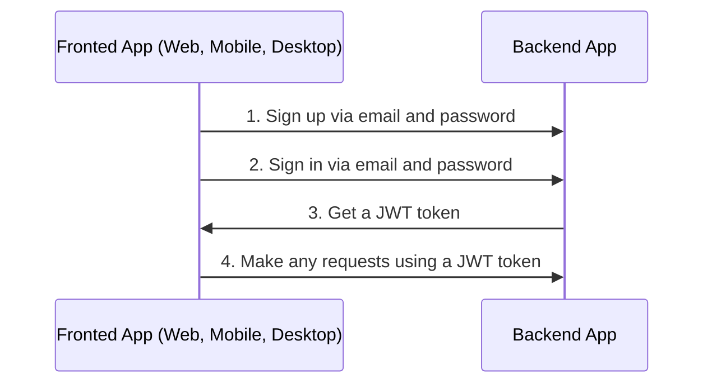

# Auth

## Table of Contents <!-- omit in toc -->

- [General info](#general-info)
  - [Auth via email flow](#auth-via-email-flow)
  - [Auth via external services or social networks flow](#auth-via-external-services-or-social-networks-flow)
- [Configure Auth](#configure-auth)
- [About JWT strategy](#about-jwt-strategy)
- [Refresh token flow](#refresh-token-flow)
  - [Video example](#video-example)
  - [Support login for multiple devices / Sessions](#support-login-for-multiple-devices--sessions)
- [Logout](#logout)
- [Q\&A](#qa)
  - [After `POST /api/v1/auth/logout` or removing session from the database, the user can still make requests with an `access token` for some time. Why?](#after-post-apiv1authlogout-or-removing-session-from-the-database-the-user-can-still-make-requests-with-an-access-token-for-some-time-why)

---

## General info

### Auth via email flow

By default boilerplate used sign in and sign up via email and password.



<https://user-images.githubusercontent.com/6001723/224566194-1c1f4e98-5691-4703-b30e-92f99ec5d929.mp4>


1. Make any requests using a JWT token

---

## Configure Auth

1. Generate secret keys for `access token` and `refresh token`:

   ```bash
   node -e "console.log('\nAUTH_JWT_SECRET=' + require('crypto').randomBytes(256).toString('base64') + '\n\nAUTH_REFRESH_SECRET=' + require('crypto').randomBytes(256).toString('base64') + '\n\nAUTH_FORGOT_SECRET=' + require('crypto').randomBytes(256).toString('base64') + '\n\nAUTH_CONFIRM_EMAIL_SECRET=' + require('crypto').randomBytes(256).toString('base64'));"
   ```

1. Go to `/.env` and replace `AUTH_JWT_SECRET` and `AUTH_REFRESH_SECRET` with output from step 1.

   ```text
   AUTH_JWT_SECRET=HERE_SECRET_KEY_FROM_STEP_1
   AUTH_REFRESH_SECRET=HERE_SECRET_KEY_FROM_STEP_1
   ```
## About JWT strategy

In the `validate` method of the `src/auth/strategies/jwt.strategy.ts` file, you can see that we do not check if the user exists in the database because it is redundant, it may lose the benefits of the JWT approach and can affect the application performance.

To better understand how JWT works, watch the video explanation https://www.youtube.com/watch?v=Y2H3DXDeS3Q and read this article https://jwt.io/introduction/

```typescript
// src/auth/strategies/jwt.strategy.ts

@Injectable()
export class JwtStrategy extends PassportStrategy(Strategy, 'jwt') {
  // ...

  public validate(payload) {
    if (!payload.id) {
      throw new UnauthorizedException();
    }

    return payload;
  }
}
```

> If you need to get full user information, get it in services.

## Refresh token flow

1. On sign in (`POST /api/v1/auth/email/login`) you will receive `token`, `tokenExpires` and `refreshToken` in response.
1. On each regular request you need to send `token` in `Authorization` header.
1. If `token` is expired (check with `tokenExpires` property on client app) you need to send `refreshToken` to `POST /api/v1/auth/refresh` in `Authorization` header to refresh `token`. You will receive new `token`, `tokenExpires` and `refreshToken` in response.

### Video example

https://github.com/brocoders/nestjs-boilerplate/assets/6001723/f6fdcc89-5ec6-472b-a6fc-d24178ad1bbb

### Support login for multiple devices / Sessions

Boilerplate supports login for multiple devices with a Refresh Token flow. This is possible due to `sessions`. When a user logs in, a new session is created and stored in the database. The session record contains `sessionId (id)`, `userId`, and `hash`.

On each `POST /api/v1/auth/refresh` request we check `hash` from the database with `hash` from the Refresh Token. If they are equal, we return new `token`, `tokenExpires`, and `refreshToken`. Then we update `hash` in the database to disallow the use of the previous Refresh Token.

## Logout

1. Call following endpoint:

   ```text
   POST /api/v1/auth/logout
   ```

2. Remove `access token` and `refresh token` from your client app (cookies, localStorage, etc).

## Q&A

### After `POST /api/v1/auth/logout` or removing session from the database, the user can still make requests with an `access token` for some time. Why?

It's because we use `JWT`. `JWTs` are stateless, so we can't revoke them, but don't worry, this is the correct behavior and the access token will expire after the time specified in `AUTH_JWT_TOKEN_EXPIRES_IN` (the default value is 15 minutes). If you still need to revoke `JWT` tokens immediately, you can check if a session exists in [jwt.strategy.ts](https://github.com/brocoders/nestjs-boilerplate/blob/2896589f52d2df025f12069ba82ba4fac1db8ebd/src/auth/strategies/jwt.strategy.ts#L20-L26) on each request. However, it's not recommended because it can affect the application's performance.

---

Previous: [Working with database](database.md)

Next: [Serialization](serialization.md)
